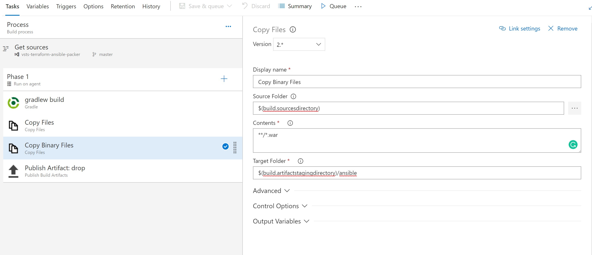
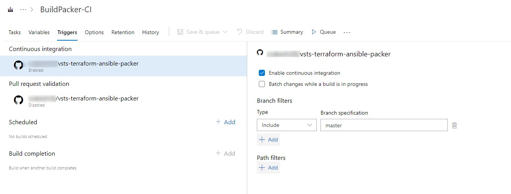
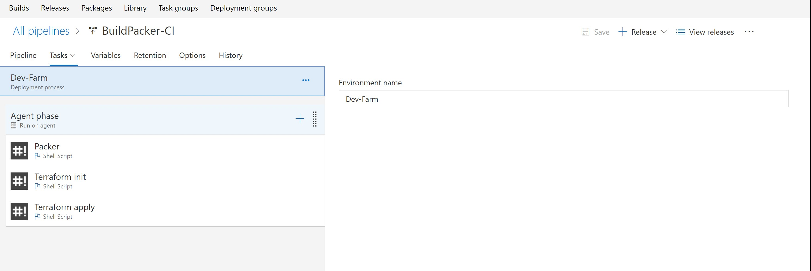

Continuous Integration and Deployment using VSTS , Packer, Terraform and Ansible

================================================================================

This repository contains code for the "Building Immutable infastructure Demo". Following is the flow:
- VSTS Build gets and packages artifacts from github 
- VSTS Release invokes packer to build image from Azure Marketplace Ubuntu image and save into ManagedDisk
- Packer uses `ansible-local` provisioner to install Apache and application code into the image
- VSTS Release invokes Terraform to provision Infrastructure (VMSS, LB, NSG) and point VMSS to image stored by packaer in ManagedDisks

## High Level Steps

Step1) DevOps commit code or configuration change

Step2) VSTS Build builds and packages application

Step3) VSTS Release invokes Packer to build a Linux image and store it in Managed Disks

Step4) Packer invokes the Ansible Playbook provisioner to install JDK, Tomcat and SpringBoot application

Step5) VSTS Release invokes Terraform to provision Infrastructure and uses Packer build image

## Packer
Packer template for Azure Image is located at `packer/app.json`. It stores prepared image in managed disks in Resource group provided by environment variable `ARM_RESOURCE_GROUP_DISKS`, this resource group should be created before the build (TODO: add creation to pipeline)

Packer will invoke `ansible-local` provisioner that will copy required files and invoke  `apache.yml` Ansible playbook
 
## Ansible
Ansible playbook`packer/apache.yml` installs and congigures Apache and copies application files (HTMLs, Images)
(TODO: wire more sophisticated playbook)

## Terraform
Terraform template is located at `terraform/azure`. It creates VM Scale Set based on Packer prepared imagestored in Managed disks
VSTS uses Azure Storage backend to store state file.  Storrge account and Container should be created before staring the build. (Defaults are in backend.tfvars)

## Prerequisites:

Configure custom VSTS agent with required tools as described in “How to create a custom VSTS agent on Azure ACI with Terraform“
Service Principal with access to the Subscription
Resource Group in which managed disks will be created
Storage Account/Container to save Terraform state in (update “backend.tfvars” in the Terraform templates below with the  storage account names).
Terraform must store state about your managed infrastructure and configuration. This state is used by Terraform to map real world resources to your configuration, keep track of metadata, and to improve performance for large infrastructures.
Ansible task extension installed from VSTS marketplace

Spring Boot Application Build
The application used for this example is the Java Spring Boot application from part 1 of this tutorial. First, we build and package the Spring Boot application using Gradle. You can import the full build definition from this GitHub repository or create a Java Gradle project from scratch by following the steps provided in this documentation: “Build your Java app with Gradle.” Here is outline of the steps and commands customizations:

Refer to full blog post https://open.microsoft.com/2018/05/23/immutable-infrastructure-azure-vsts-terraform-packer-ansible/

## Build Provisioning

1. Create a build definition (Build & Release tab > Builds).
2. Search and use “Gradle” definition.
  In the repository tab of build definition make sure the repository selected is the one where you pushed (Git).

3. In ”Copy Files” – customize the step to copy all required scripts directories with templates to resulting artifact.

Display Name: Copy Files

Source Folder : $(build.sourcesdirectory)

Contents:
ansible/**
terraform/**
packer/**

Target Folder: $(build.artifactstagingdirectory)

4. Add an additional “Copy Files” step, which will copy the Java WAR file to the resulting build artifact.

Display Name: Copy Binary Files

Source Folder : $(build.sourcesdirectory)

Contents:

**/*.war

Target Folder: $(build.artifactstagingdirectory)/ansible

5. On the Triggers tab, enable continuous integration (CI). This tells the system to queue a build whenever new code is committed. Save and queue the build.

6. Save Build Tasks

## Infrastructure Provisioning

In this flow, Packer builds an Azure VM image and uses Ansible as the provisioner. Ansible Playbook installs the required software (Apache) and application on the server. The completed image is saved in Azure Managed disks. Terraform is used to build the infrastructure based on the Packer image.

Here is the Release pipeline definition, which can be imported from GitHub.

Step1) Create a New Release 

Step2) Add Steps to New Release Env - call it Dev

Step3) Add Tasks 

a. Search for Bash Script --> Name it Packer

Display Name: Packer
Script Path: $(System.DefaultWorkingDirectory)/BuildPacker-CI/drop/packer/buildvm.sh
Arguments: $(ARM_CLIENT_ID) $(ARM_CLIENT_SECRET) $(ARM_SUBSCRIPTION_ID) $(ARM_TENANT_ID) $(ARM_RESOURCE_GROUP_DISKS) $(System.DefaultWorkingDirectory)/BuildPacker-CI/drop

Advanced Specify Working Dir : $(System.DefaultWorkingDirectory)/BuildPacker-CI/drop/packer

ReferenceName : manageddiskname

b Task Terraform Init

Display Name : Terraform init

Script Path: $(System.DefaultWorkingDirectory)/BuildPacker-CI/drop/terraform/init.sh

Arguments:  $(ARM_CLIENT_ID) $(ARM_CLIENT_SECRET) $(ARM_SUBSCRIPTION_ID) $(ARM_TENANT_ID) $(ARM_ACCESS_KEY)

Advance : Specify Working Directory : $(System.DefaultWorkingDirectory)/BuildPacker-CI/drop/terraform/azure

