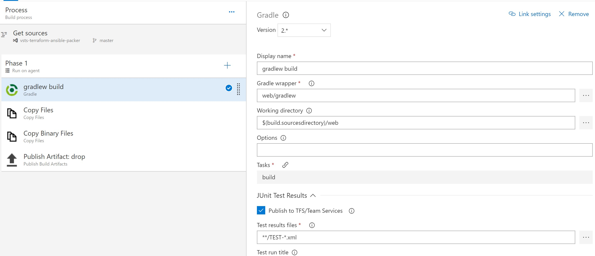
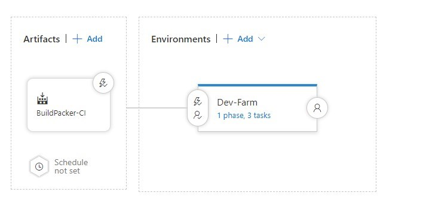
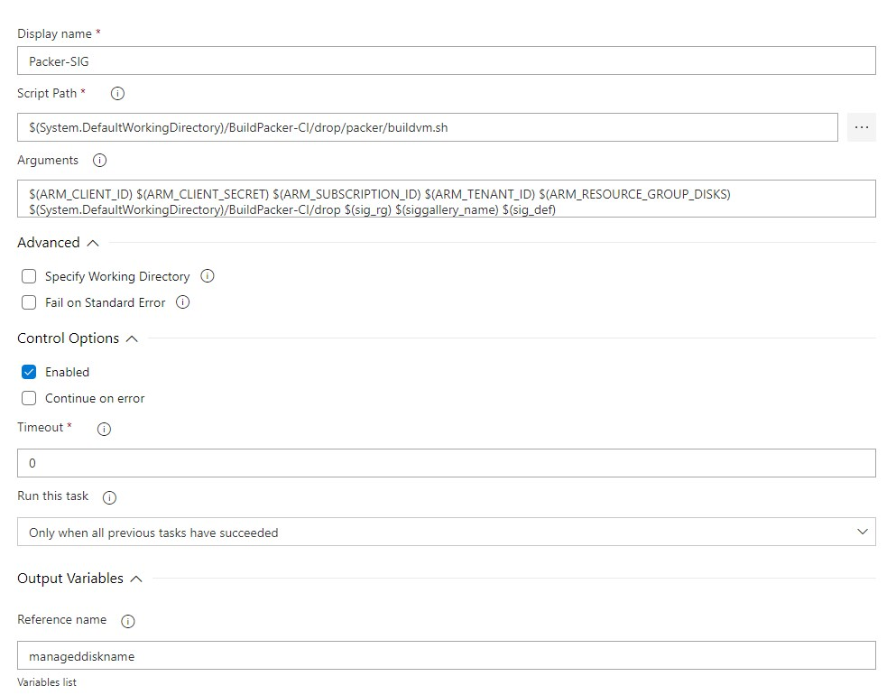
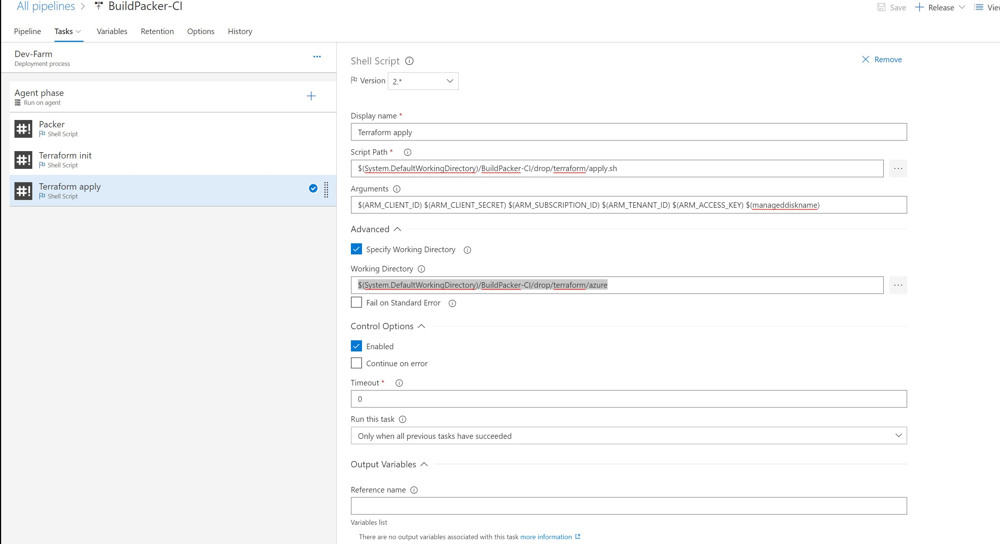
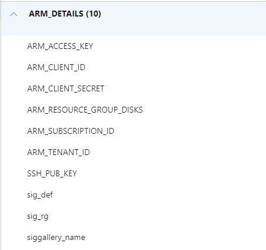
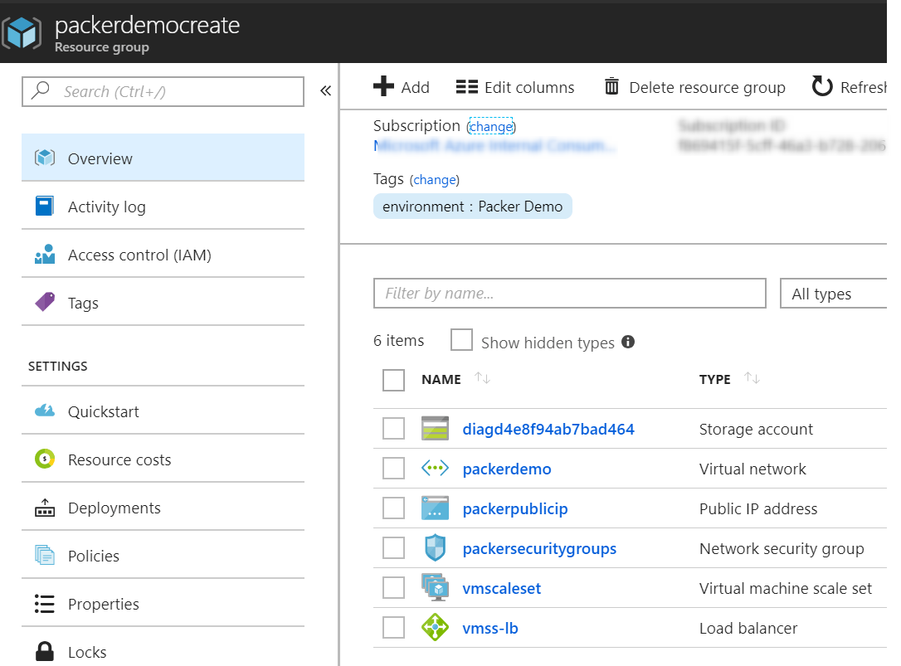

Continuous Integration and Deployment using VSTS , Packer, Terraform and Ansible

================================================================================

This repository contains code for the "Building Immutable infastructure Demo". Following is the flow:
- VSTS Build gets and packages artifacts from github 
- VSTS Release invokes packer to build image from Azure Marketplace Ubuntu image and save into ManagedDisk
- Packer uses `ansible-local` provisioner to install Apache and application code into the image
- VSTS Release invokes Terraform to provision Infrastructure (VMSS, LB, NSG) and point VMSS to image stored by packaer in ManagedDisks

## High Level Steps

Step1) DevOps commit code or configuration change

Step2) VSTS Build builds and packages application

Step3) VSTS Release invokes Packer to build a Linux image and store it in Managed Disks

Step4) Packer invokes the Ansible Playbook provisioner to install JDK, Tomcat and SpringBoot application

Step5) VSTS Release invokes Terraform to provision Infrastructure and uses Packer build image

## Packer
Packer template for Azure Image is located at `packer/app.json`. It stores prepared image in managed disks in Resource group provided by environment variable `ARM_RESOURCE_GROUP_DISKS`, this resource group should be created before the build (TODO: add creation to pipeline)

Packer will invoke `ansible-local` provisioner that will copy required files and invoke  `apache.yml` Ansible playbook
 
## Ansible
Ansible playbook`packer/apache.yml` installs and congigures Apache and copies application files (HTMLs, Images)
(TODO: wire more sophisticated playbook)

## Terraform
Terraform template is located at `terraform/azure`. It creates VM Scale Set based on Packer prepared imagestored in Managed disks
VSTS uses Azure Storage backend to store state file.  Storrge account and Container should be created before staring the build. (Defaults are in backend.tfvars)

## Prerequisites:

Configure custom VSTS agent with required tools as described in “How to create a custom VSTS agent on Azure ACI with Terraform : https://open.microsoft.com/2018/05/22/how-to-create-vsts-agent-azure-aci-terraform/“

Service Principal with access to the Subscription

Resource Group in which managed disks will be created

Storage Account/Container to save Terraform state in (update “backend.tfvars” in the Terraform templates below with the  storage account names).

Terraform must store state about your managed infrastructure and configuration. 

This state is used by Terraform to map real world resources to your configuration, keep track of metadata, and to improve performance for large infrastructures.

Ansible task extension installed from VSTS marketplace

Spring Boot Application Build

The application used for this example is the Java Spring Boot application. 

First, we build and package the Spring Boot application using Gradle. 

You can import the full build definition from this GitHub repository or 

create a Java Gradle project from scratch by following the steps provided in this documentation: “Build your Java app with Gradle.” 

Here is outline of the steps and commands customizations:

Refer to full blog post https://open.microsoft.com/2018/05/23/immutable-infrastructure-azure-vsts-terraform-packer-ansible/

## Build Provisioning

1. Create a build definition (Build & Release tab > Builds).
2. Search and use “Gradle” definition.
  In the repository tab of build definition make sure the repository selected is the one where you pushed (Git).

3. In ”Copy Files” – customize the step to copy all required scripts directories with templates to resulting artifact.

Display Name: Copy Files

Source Folder : $(build.sourcesdirectory)

Contents:
ansible/**
terraform/**
packer/**

Target Folder: $(build.artifactstagingdirectory)

4. Add an additional “Copy Files” step, which will copy the Java WAR file to the resulting build artifact.

Display Name: Copy Binary Files

Source Folder : $(build.sourcesdirectory)

Contents:

**/*.war

Target Folder: $(build.artifactstagingdirectory)/ansible

5. On the Triggers tab, enable continuous integration (CI). This tells the system to queue a build whenever new code is committed. Save and queue the build.

6. Save Build Tasks

## Infrastructure Provisioning

In this flow, Packer builds an Azure VM image and uses Ansible as the provisioner. Ansible Playbook installs the required software (Apache) and application on the server. The completed image is saved in Azure Managed disks. Terraform is used to build the infrastructure based on the Packer image.

Here is the Release pipeline definition, which can be imported from GitHub.

Step1) Create a New Release 

Step2) Add Steps to New Release Env - call it Dev

Step3) Add Tasks 

a. Task Packer 

Search for Bash Script --> Name it Packer

Display Name: Packer

Script Path: $(System.DefaultWorkingDirectory)/BuildPacker-CI/drop/packer/buildvm.sh

Arguments: $(ARM_CLIENT_ID) $(ARM_CLIENT_SECRET) $(ARM_SUBSCRIPTION_ID) $(ARM_TENANT_ID) $(ARM_RESOURCE_GROUP_DISKS) $(System.DefaultWorkingDirectory)/BuildPacker-CI/drop

Advanced Specify Working Dir : $(System.DefaultWorkingDirectory)/BuildPacker-CI/drop/packer

ReferenceName : manageddiskname

Script executes the Packer template and sets the VSTS output variable “manageddiskname” to the disk created by Packer. This image will be used by Terraform to point VM ScaleSets to.

Packer template uses Azure builder to create image based on Red Hat and saves it in Managed Disk in the provided resource group (name includes timestamp for ease of identification).

To install the required components and application we are using Ansible Playbook. To invoke it, define a provisioner in the Packer template. First, we use shell provisioner to install Ansible, then “Ansible-local” to invoke the playbook on the image being created, and then shutdown the VM.

Resulting image will have all the components installed using Ansible playbook. This solution does not require SSH to be enabled on the VM as it uses local provisioner.

Note: For Ansible to find all the roles and subdirectories “playbook_dir” should be specified. It will direct Ansible to copy all directory and subfolders to the staging directory, where Ansible provisioner is invoked in.

The Ansible Playbook used in the example is running on localhost, installs JDK, Tomcat, and the Java Spring Boot application.

As a result, we can see the image build built, the Ansible Playbook run, and the managed disk name as an output of the task.

The newly created image could be verified in the resource group (“managed-disks” in our example).

Each image has timestamp as a suffix that helps to identify images for rollback and promotion (could use git hash or tag for traceability to source control).

b. Task Terraform Init

Display Name : Terraform init

Script Path: $(System.DefaultWorkingDirectory)/BuildPacker-CI/drop/terraform/init.sh

Arguments:  $(ARM_CLIENT_ID) $(ARM_CLIENT_SECRET) $(ARM_SUBSCRIPTION_ID) $(ARM_TENANT_ID) $(ARM_ACCESS_KEY)

Advance : Specify Working Directory : $(System.DefaultWorkingDirectory)/BuildPacker-CI/drop/terraform/azure

Terraform must initialize Azure Resource provider and the configured backend for keeping the state (Azure storage in this example) before the use. Here is the snippet doing it from our Terraform template:

Terraform initialization can be done by simply running “terraform init” command.

To avoid hard coding backend storage in the Terraform template, we are using a partial configuration and providing the required backend configuration in variables file – “backend.tfvars.” Here a is configuration that uses a storage account we created as part of the prerequisites:

To initialize Terraform shell script will run init command with provided backend configuration:

Upon a successful run it will have following output indication that Terraform has been initialized.

c. Task Terraform Apply

Display Name: Terraform Apply

Script Path : $(System.DefaultWorkingDirectory)/BuildPacker-CI/drop/terraform/apply.sh

Arguments: $(ARM_CLIENT_ID) $(ARM_CLIENT_SECRET) $(ARM_SUBSCRIPTION_ID) $(ARM_TENANT_ID) $(ARM_ACCESS_KEY) $(manageddiskname)

Specify Working Dir : $(System.DefaultWorkingDirectory)/BuildPacker-CI/drop/terraform/azure

Terraform generates an execution plan describing what it will do to reach the desired state, and then executes it to build the described infrastructure. As the configuration changes, Terraform is able to determine what changed and create incremental execution plans that can be applied.

In the example below, Terraform detected that some changes are required in the infrastructure.

The shell file executes the Terraform build and uses the build by Packer ManagedDisk name to locate the image used in the VM scale set.

The full Terraform template can be found in GitHub.

It provisions the resource group, virtual network, subnet, public IP, load balancer and NAT rules, and VM scale set.

Here is the definition of VM scale set, pointing to the Packer image. Resources that are not created by Terraform are referred to as “data” definition as opposed to “resource.”

d. Create Variable Group and Link to this Pipeline

ARM_ACCESS_KEY

ARM_CLIENT_ID

ARM_CLIENT_SECRET

ARM_RESOURCE_GROUP_DISKS

ARM_SUBSCRIPTION_ID

ARM_TENANT_ID

SSH_PUB_KEY

Step 4) Make sure to update following files to reflect your Storage account names, keys and Resource Group

/terraform/azure/backend.tfvars

/terraform/azure/variables.tf  

Step 5) Ensure respective RG / Storage Accounts and Container are Created in Azure Portal

Step6) Run Build and Release and Monitor resources being created

Step7) Provisioned infrastructure will look like this:

As a result of the build, we have a Spring Boot application up and running on an Azure VM scale set and it could be scaled up and down quickly, according to demand.  Example URL : http://demopackeriac.westus2.cloudapp.azure.com/spring-music/

Conclusion

In this example, we demonstrated a simple flow that provides application deployment and infrastructure automation, and builds the immutable image that can be promoted between environments. 

The build history is stored in the Azure resource group and each image is tagged, and could be rolled back very easily by pointing the VM scale set to a previous version.
